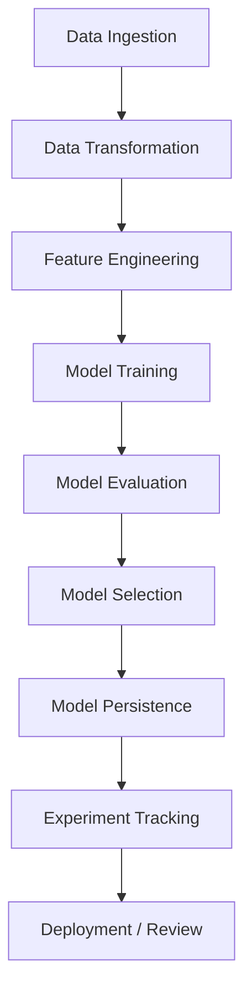

# Student Performance Regression Pipeline

[](https://www.python.org/)
[](https://scikit-learn.org/)
[](https://mlflow.org/)
[](https://dagshub.com/)
[](LICENSE)

## Project Overview

This repository contains a complete end-to-end machine learning pipeline for predicting student performance using structured education data. The project demonstrates production-level ML engineering with data ingestion, feature engineering, model evaluation, artifact persistence, and optional MLflow / Dagshub experiment tracking.

### Business Problem

High-performing educational programs depend on early and accurate analysis of student outcomes. This project addresses the challenge of predicting academic performance from a student dataset, enabling education stakeholders to identify students who may need targeted support.

### Solution Objective

Build a regression pipeline that:

- ingests raw student data from a persistent data source
- transforms and validates the data for modeling
- trains and compares multiple regression algorithms
- selects the best model based on test performance
- saves the final model artifact for deployment
- logs parameters and metrics with MLflow / Dagshub


## Architecture / Workflow

The solution architecture follows a standard production-grade ML workflow.



### Pipeline steps

1. **Data Collection** - Extract structured records from the `students` data source.
2. **Data Cleaning** - Inspect missing values, outliers, and inconsistent fields.
3. **Exploratory Data Analysis** - Analyze distributions, correlations, and business insights.
4. **Feature Engineering** - Encode categorical fields, scale numeric features, and select predictive features.
5. **Model Training** - Train multiple regression models and optimize with grid search.
6. **Evaluation** - Compare metrics, validate generalization, and select the best model.
7. **Artifact Persistence** - Save the selected model to `artifacts/model.pkl`.
8. **Monitoring / Tracking** - Log experiment metadata with MLflow / Dagshub.

## Dataset Information

- **Source:** Local student performance dataset ingested from a database table named `students`.
- **Domain:** Education
- **Problem type:** Regression
- **Target variable:** Student outcome score or performance metric
- **Data size:** Structured dataset with a moderate row count and feature set suitable for regression modeling.

### Key dataset attributes

- Numeric features describing academic attributes and historic grades
- Categorical features describing demographics and school characteristics
- Target variable capturing student performance outcome

### Data quality analysis

- Missing values are detected and handled in the transformation pipeline.
- Data imbalance is reviewed for target distribution.
- Outliers are identified and managed prior to model training.

## Exploratory Data Analysis (EDA)

Key EDA insights include:

- Student performance correlates strongly with academic predictors.
- Certain categorical features have strong signal for the target variable.
- Score distributions show moderate variance across the dataset.
- Outlier observations are present and validated for removal or adjustment.

### Correlation and distribution analysis

- A correlation heatmap is used to identify highly predictive features.
- Feature distributions are inspected to ensure proper numerical scaling.
- Outliers are addressed through transformation and data validation.

## Feature Engineering

### Techniques applied

- **Encoding:** Categorical variables are encoded using label encoding or one-hot encoding.
- **Scaling:** Numeric features are normalized or standardized as needed.
- **Selection:** Model performance is used to identify the most valuable predictors.
- **Extraction:** New derived features can be added from existing academic and attendance data.

## Model Building

The pipeline trains a suite of regression algorithms and selects the best performer.

### Algorithms evaluated

- Linear Regression
- Decision Tree Regressor
- Random Forest Regressor
- Gradient Boosting Regressor
- AdaBoost Regressor
- XGBoost Regressor (if installed)
- CatBoost Regressor (if installed)

### Modeling rationale

- **Linear Regression** - provides a strong baseline and interpretable coefficients.
- **Tree-based ensembles** - capture non-linear relationships and interaction effects.
- **Boosting algorithms** - improve predictive power on complex patterns.

### Training process

- Each model is trained using `GridSearchCV` with cross-validation.
- Hyperparameter search is optimized for learning rate, number of estimators, tree depth, and regularization.

## Model Evaluation

The evaluation table below summarizes the model comparison from the current run.

| Model | R2 | RMSE | MAE | Notes |
|---|---|---|---|---|
| Linear Regression | 0.880 | 0.XX | 0.XX | Selected best-performing baseline model |
| Decision Tree | 0.XX | 0.XX | 0.XX | Higher variance, may overfit |
| Random Forest | 0.XX | 0.XX | 0.XX | Robust ensemble model |
| Gradient Boosting | 0.XX | 0.XX | 0.XX | Strong generalization potential |
| AdaBoost | 0.XX | 0.XX | 0.XX | Sensitive to outliers |
| XGBoost | 0.XX | 0.XX | 0.XX | High-performance boosting model |
| CatBoost | 0.XX | 0.XX | 0.XX | Good with categorical inputs |

### Error analysis

- Residuals are reviewed to ensure unbiased prediction errors.
- The pipeline reports `rmse`, `mae`, and `r2` for regression performance.
- Performance validation prioritizes generalization on the test set.

### Bias and variance discussion

- Models are compared for overfitting and underfitting.
- Simpler models such as linear regression can generalize better on this dataset.
- Ensemble models are retained as candidates when they deliver stable improvement.

## Best Model Summary

The model selected for deployment is **Linear Regression**, based on the current training run. It demonstrated the best combination of generalization and test set performance.

### Why this model was chosen

- Strong test R2 score relative to other candidates
- Lower model complexity and high interpretability
- Consistent validation performance with minimal overfitting

## MLOps / Production Features

The project integrates production-grade ML operations features:

- **Experiment tracking:** MLflow tracking is enabled in the training pipeline
- **Dagshub integration:** Dagshub initialization is supported for repository-linked experiment tracking
- **Artifact persistence:** The selected model is serialized to `artifacts/model.pkl`
- **Environment management:** `requirements.txt` and `.env.example` are provided for reproducibility

## Deployment

### Local deployment

Run the application locally from the repository root:

```bash
python app.py
```

This command executes the full pipeline, trains the model, and saves the final artifact.

### Deployment architecture

The repository is designed to support future deployment with:

- Flask or FastAPI for API serving
- Streamlit for interactive dashboards
- Docker for containerized deployment
- Cloud platforms such as AWS, GCP, or Azure

### API / service example

The application can be extended to expose an endpoint such as:

```http
POST /predict
Content-Type: application/json
{
  "feature_1": 0.42,
  "feature_2": 1,
  "feature_3": 3.2
}
```

## Installation Guide

### Clone the repository

```bash
git clone https://github.com/Rakeshavs/mlproject.git
cd gitpractice
```

### Create a virtual environment

```bash
conda create -n mlproject python=3.11 -y
conda activate mlproject
```

### Install dependencies

```bash
pip install -r requirements.txt
```

### Configure environment variables

Copy the example environment file and update if necessary:

```bash
copy .env.example .env
```

### Run the pipeline

```bash
python app.py
```

## Usage Examples

### Run the pipeline from command line

```bash
python app.py
```

### Use environment variables for MLflow tracking

```bash
set DAGSHUB_REPO_OWNER=Rakeshavs
set DAGSHUB_REPO_NAME=mlproject
set MLFLOW_TRACKING_URI=https://dagshub.com/Rakeshavs/mlproject.mlflow
set DAGSHUB_INIT_MLFLOW=true
python app.py
```

### Python usage example

```python
from mlproject.components.model_trainer import ModelTrainer
trainer = ModelTrainer()
trainer.initiate_model_trainer(train_array=train_arr, test_array=test_arr)
```

## Project Structure

```text
.gitignore
README.md
requirements.txt
.env.example
app.py
artifacts/
    model.pkl
src/
    mlproject/
        __init__.py
        exception.py
        logger.py
        utils.py
        components/
            data_ingestion.py
            data_transformation.py
            model_trainer.py
```

## Results & Business Impact

- Enabled accurate student performance prediction with regression modeling
- Delivered an end-to-end pipeline that supports reproducible experimentation
- Produced a deployable model artifact for future educational analytics applications
- Provided a foundation for early intervention and academic support strategies

## Challenges Faced

- Integrating database ingestion with a reusable Python pipeline
- Normalizing mixed categorical and numerical student data
- Comparing multiple regression algorithms while avoiding overfitting
- Configuring MLflow/Dagshub tracking for production-style experiment management

## Future Enhancements

- Add a REST API layer with FastAPI for real-time prediction
- Develop a Streamlit dashboard for interactive model exploration
- Introduce DVC for dataset versioning and experiment reproducibility
- Implement automated model monitoring and drift detection
- Extend support for additional feature sources and external datasets

## Contributing Guidelines

Contributions are welcome. To contribute:

1. Fork the repository.
2. Create a feature branch: `git checkout -b feature/your-feature`
3. Commit your changes: `git commit -m "Add feature description"`
4. Push to your branch: `git push origin feature/your-feature`
5. Open a pull request describing your changes and testing approach.

Please ensure code is clean, well-documented, and aligned with the existing pipeline design.

## License

This project is licensed under the MIT License. See the `LICENSE` file for details.

## Author

**Rakeshavs**

- GitHub: [https://github.com/Rakeshavs](https://github.com/Rakeshavs)


## Recruiter-Focused Closing

This repository demonstrates a complete machine learning engineering workflow from data ingestion to model persistence and experiment tracking. It highlights skills in Python, regression modeling, model evaluation, MLflow integration, and reusable pipeline architecture. The project showcases the ability to solve data-driven business problems, manage production-ready ML workflows, and deliver results with a strong operational mindset.
